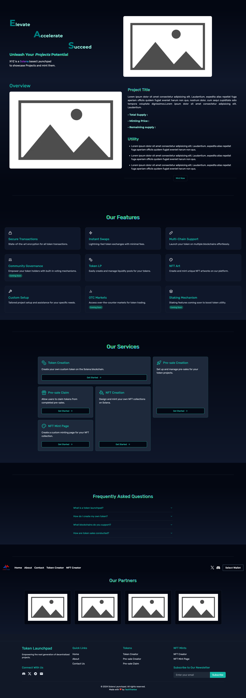

# Solana Launchpad Template


A Solana launchpad frontend template — themed landing sections, wallet integration, and frontend screens for token/NFT creation, minting, and presales, built on Next.js 14, Tailwind CSS, and Solana Web3.js. Frontend only; bring your own Solana program for on-chain logic.



## Features

**Launchpad screens (frontend UI)**

- Token Creator — `app/token-creator` — UI to configure a token launch.
- NFT Creator — `app/nft-creator` — UI to configure an NFT collection.
- Mint NFT — `app/mint-NFT` — minting page.
- Presale Creator — `app/presale-creator` — presale setup UI.
- Presale Claim — `app/presale-claim` — presale claim UI.
- About — `app/about` — about page.
- Contact — `app/contact` — contact page.

**Landing sections**

- Floating glassmorphism header with a mobile sheet menu.
- Animated hero, features grid, services, partners logo grid, FAQ, and a CTA section.
- Scroll-to-top button and smooth scrolling via Lenis.
- Animated sun/moon theme toggle.

**Theming and integration**

- Light ("Creamy/Blue") and Dark ("Deep Space") themes via `next-themes`.
- Solana wallet integration via Wallet Adapter (Phantom and others); signs in-wallet, never handles private keys.
- Responsive, mobile-friendly layout.

## Quick start

```bash
git clone https://github.com/TechTronixx/sol-launchpad.git && cd sol-launchpad && bun install && bun run dev
```

Open http://localhost:3000.

## Requirements

- [Bun](https://bun.sh) (or Node 18+ with npm/pnpm as a fallback)
- A Solana wallet extension such as [Phantom](https://phantom.app) for wallet-adapter features

## Manual install

```bash
git clone https://github.com/TechTronixx/sol-launchpad.git
cd sol-launchpad
bun install
bun run dev        # development
bun run build      # production build
bun run start      # serve the production build
```

## Project structure

| Path | Contents |
|------|----------|
| `app/` | App Router pages, layout, fonts, sitemap, robots, loading, error |
| `app/token-creator`, `nft-creator`, `mint-NFT` | Launchpad creation and minting screens |
| `app/presale-creator`, `presale-claim` | Presale setup and claim screens |
| `app/about`, `contact` | Content pages |
| `components/` | Feature sections (Header, Hero, Features, Services, Partners, FAQ, Footer, CTA) |
| `components/ui/` | Shadcn UI primitives |
| `components/magicui/` | Magic UI components (magic card, animated list) |
| `providers/` | Context providers (theme, wallet) |
| `hooks/` | Custom hooks |
| `lib/` | Utilities and dynamic imports |
| `images/` | Static assets imported in code |
| `public/` | Static assets served directly |

The home page is `app/page.tsx`. Landing sections live in `components/`.

## Customization

- **Theme colors** — semantic tokens (`primary`, `secondary`, `accent`, `muted`) in `app/globals.css`.
- **Wallet network / RPC endpoint** — `providers/ClientWalletProvider.tsx`.
- **Fonts** — `app/fonts.ts` (Montserrat for headings, Rubik / Space Grotesk for body).
- **On-chain logic** — the launchpad screens are UI only. Wire token/NFT minting and presale interactions to your own Solana program and RPC.

## Notes

- Frontend template only. It does not deploy programs, custody funds, or place on-chain transactions beyond what the connected browser wallet signs.
- Wallet Adapter connects to the user's browser wallet and signs in-wallet — the app never handles private keys.
- Do not commit `.env`, private keys, or RPC URLs containing secrets.

## Development

```bash
bun run dev      # dev server
bun run build    # production build
bun run lint     # ESLint
```

No automated test suite yet.

## Contributing

Contributions are welcome. See [CONTRIBUTING.md](CONTRIBUTING.md) for the branch workflow (`development` → PR → `master`) and guidelines. Report bugs and share ideas via [Issues](https://github.com/TechTronixx/sol-launchpad/issues) using the bug report or feature request templates.

## Disclaimer

This is a frontend template. It does not custody funds, deploy on-chain programs, or place transactions beyond what the connected browser wallet signs. You are responsible for your Solana program, RPC usage, key handling, and compliance with applicable laws and Solana's terms. Provided "AS IS" without warranty; see LICENSE.

## License

MIT — see [LICENSE](LICENSE).
